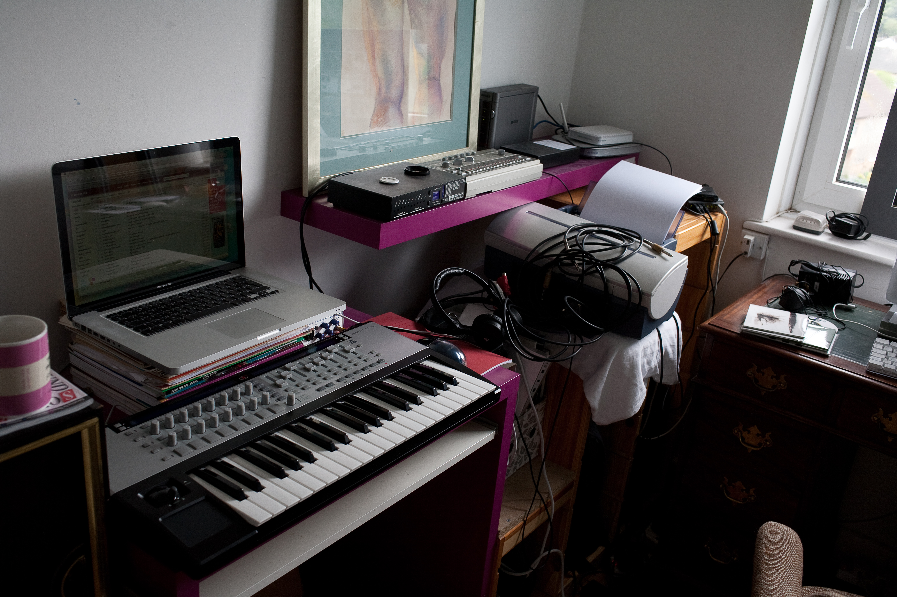
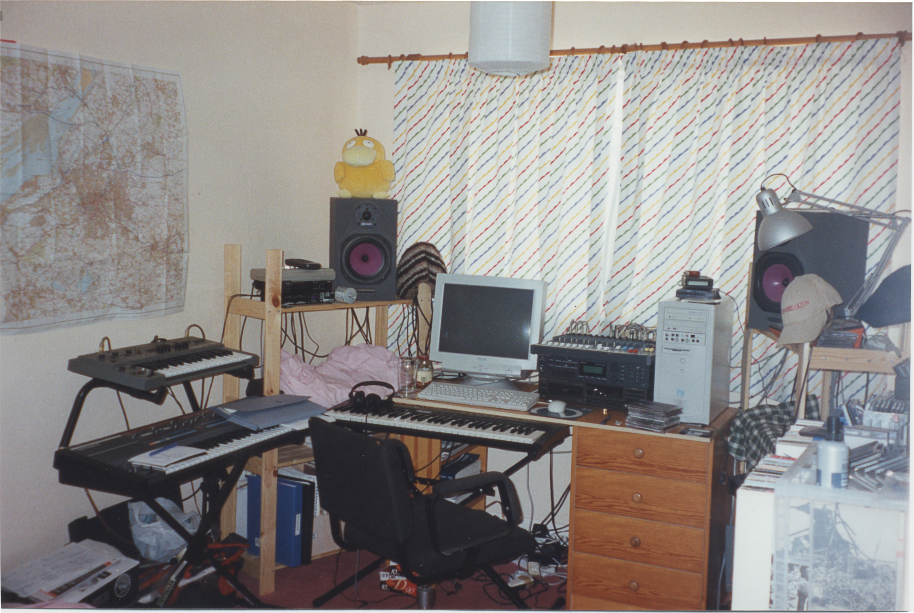
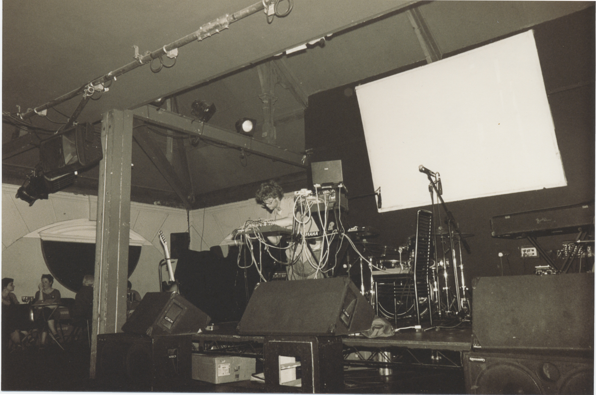
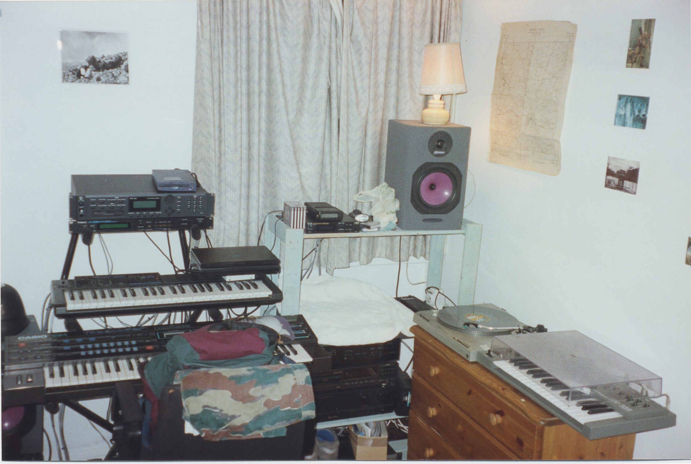
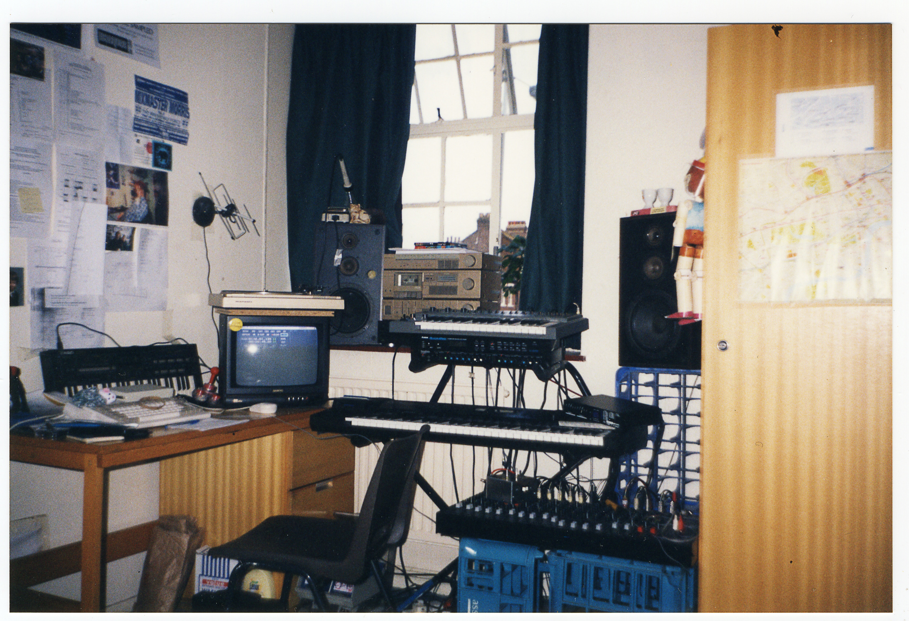
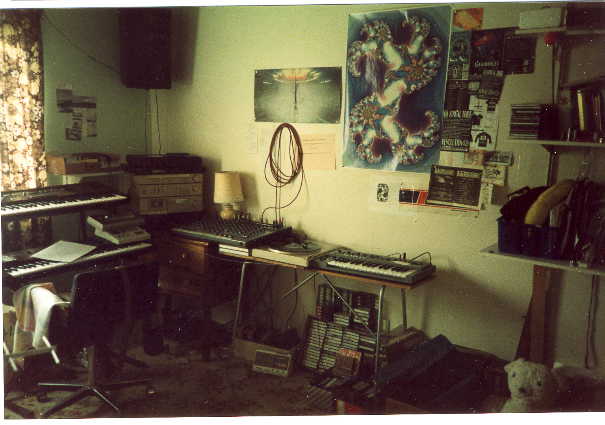
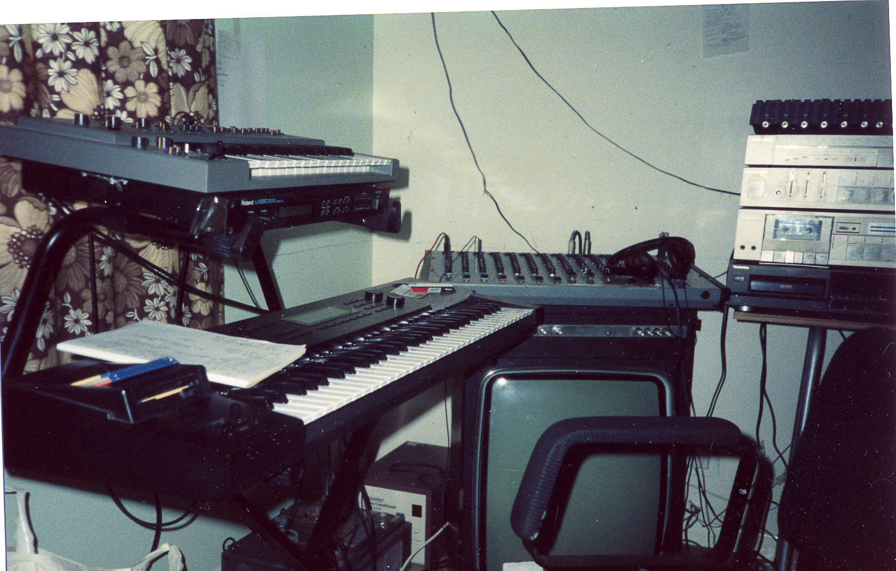

I was talking to a good friend a few years back about the act of buying and selling of gear. His preference has been to keep the synths he's bought through the years, whilst I seem to have always been buying and selling.

On the back of that conversation we both made our own versions of this list - mine was longer, of course.

I've since kept my version up to date and thought it would be fun to share here.

On the one hand, buying and selling has meant I've had the pleasure of experiencing many instruments, but on the other I weep a small tear when I remember some of the pieces I no longer own. Either way, the list is pretty much a series of memory triggers for so many happy events throughout my life.

One stand out is how many software purchases I've made are now totally unusable.

## Frome Era : 2026

- Roland JX8P synth + Dtronics DT-300 programmer : still owned
- Ableton Live Suite 12 : still owned

## Frome Era : 2017

- Apple Macbook Pro (retina 13”, early 2015) : still owned

## Japan Era : 2015

- Elektron Analog Keys 4 Keyboard : still owned
- Korg Volca Drum : still owned
- Korg DDD5 : still owned
- Mutable Instruments Braids x2 (DIY) : still owned
- Mutable Instruments Ripples x2 (DIY) : still owned
- Eurorack active multiple x2 (DIY) : still owned
- Eurorack 808 Bass drum (DIY) : still owned

## Japan Era : 2014

- Ableton Live Suite 9 : still owned, but obsolete

## Japan Era : 2012

- Audio Damage Eos : still owned, but obsolete
- Max 4 Live : still owned, but obsolete
- Akai APC40 : sold
- Akai LPK25 : still owned

## Frome Era : 2011

- Monome 256 : sold

## Frome Era : 2009

- Novation Remote SL 37 controller : sold
- GForce impOSCar softsynth : still owned, but obsolete
- Ableton Live Suite 8 : still owned, but obsolete

## Frome Era : 2004

- Yamaha Clavinova CLP220 digital piano : sold
- Elektron MachineDrum : sold

## Bristol Era : 2000

- Desktop PC P??? : taken to skip
- Roland Juno106 synth : sold
- Roland SH09 synth : sold

## Basingstoke Era : 1998

- Casio CZ101 synth (2) : sold
- Yamaha DX11 synth (2) : sold

## Leeds - Post-placement : 1997

- Oberheim DX drum machine : sold
- Emu ESi32 w/32MB sampler : sold
- Iomega 100MB ZIP drive : sold
- Spirit Folio SX 20:4:2 mixer : sold
- Harbeth XPression monitors : given away
- Sampson 240W amp : still owned, broken
- AKG C1000S condenser mic : sold
- Casio CZ1 synth : sold
- Boss SE70 effects unit : sold
- Korg Poly800 MkII synth : sold
- Yamaha DX100 synth : sold
- Roland TR606 drum machine (2) : still owned
- Alesis MMT8 sequencer : sold

## Leeds - Pre-placement : 1994

- Amiga A1200 (w/Blizzard 30MHz accelarator) + MusicX 2 software : sold
- Roland JV880 synth module : sold
- Laptop PC P133MHz : taken to skip
- Midiman 2x4 MIDI interface : taken to skip
- Roland JX3P + PG200 programmer (2) : sold
- Yamaha RY30 drum machine : sold
- Yamaha DX11 synth (1) : sold
- Aiwa HDS-1 DAT recorder : sold

## London Era : 1993

- Kenton Pro2 MIDI-CV convertor : still owned
- Studiomaster 16:2 mixer : sold
- Casio CZ101 synth (1) : sold
- Amiga A600 computer + MusicX software : sold
- Unknown brand 2 channel compressor : sold

## Shaftesbury Epoch : 1988

- Yamaha PSS470 keyboard : part exchanged
- Casio HT3000 keyboard : part exchanged
- Kawai K5 synth : sold
- Roland D10 synth : sold
- Yamaha QX5 sequencer : sold
- Yamaha MT2X 4 track : sold
- Boss DR550 drum machine : sold
- Roland SH101 synth : still owned
- Roland TR606 drum machine (1) : sold
- Roland W30 workstation : sold
- Studio Research 12:2 mixer : sold
- Roland U220 synth module : sold
- Roland SBX10 sync unit : sold
- Roland JX3P synth (1) : sold
- Alesis Quadraverb+ effects unit : sold

