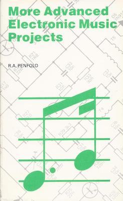
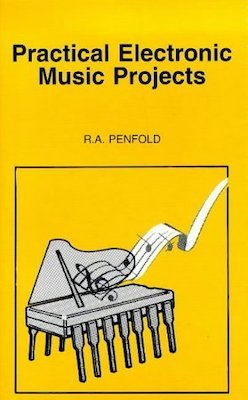

One of the questions I get asked from time to time is why I want to build so much of my Eurorack system myself. To be fair, this is also a question I also ask myself on occasion.

After all, Eurorack is no longer the niche it once was. There are thousands of modules available from manufacturers all over the world. If I want a filter, oscillator or sequencer, somebody has almost certainly already designed one that is better looking, more feature-rich and more professionally built than anything I could put together on my workbench.

So why bother?

Looking back, the answer probably lies in my teenage years. Back then, the UK electronics retailer, Maplin, sold a series of affordable electronics books written by a guy called R.A. Penfold. After complaining to my Grandad one evening that I had no idea how to build these projects, he sat me down and taught me how to translate the schematics into stripboard layouts and solder the components I bought.

  
  

From there I was able to build a ring modulator and a distortion box from the Penfold books. It was amazing that these devices worked and it felt amazing that they sounded great.

Until that point, electronic devices were opaque. They arrived from the shop, I plugged them in and I made sound within the limits of the device. The idea that I could look at a schematic, buy a handful of components and build something that processed sound in the way I wanted was a game changer.

More importantly, it taught me something about myself. It taught me that these things weren't created by people fundamentally different from me. They were created by people who had learned how they worked.

The lesson stuck.

This all led me to study Electronic Engineering and Music Technology at university, which then led me into software engineering. And although my career moved increasingly towards software, the desire to understand how things worked never really went away.

For a long time, hardware sat quietly in the background while I concentrated on software. Then Eurorack appeared and really appealed to me. Before even buying a module, I'd spend hours reading and watching videos, learning all that I could on the subject. I also learnt that people seemed to get addicted. Small systems often became large systems at quite an alarming rate.

On the back of this I asked myself a few questions: what if I don't worry about rushing to build a system? What if I don't worry about being a 'modular musician'? What if, instead, I use this new hobby as a platform to revisit the electronics knowledge I'd learnt years and years ago.

Building a module forces you to engage with it in a completely different way. You don't just learn what a circuit does; you learn why it does it. You start to understand why a designer chose a particular topology, why certain components were selected and where the compromises lie.

Eventually you move beyond building kits and start modifying things. Then you start designing small circuits of your own. Before long you're learning PCB layout, revisiting electronics theory you'd forgotten years ago and discovering things you never knew in the first place.

The finished module *almost* becomes incidental.

A DIY oscillator isn't just about an oscillator. It's an opportunity to learn about power supplies, analogue design, PCB layout, calibration, debugging and a dozen other subjects that weren't obvious until starting out on the project.

My DIY Eurorack system reflects that philosophy. Rather than being a carefully curated collection of desirable modules, it's a collection of lessons. Some modules taught me how analogue circuits work. Others taught me PCB layout. Some taught me patience. And a few have taught me failure.

To try and answer the original question, having now followed this particular thread through my life, it's not really a question of 'why' but one of 'why not.' Looking back, I suspect I was always going to approach Eurorack this way.
