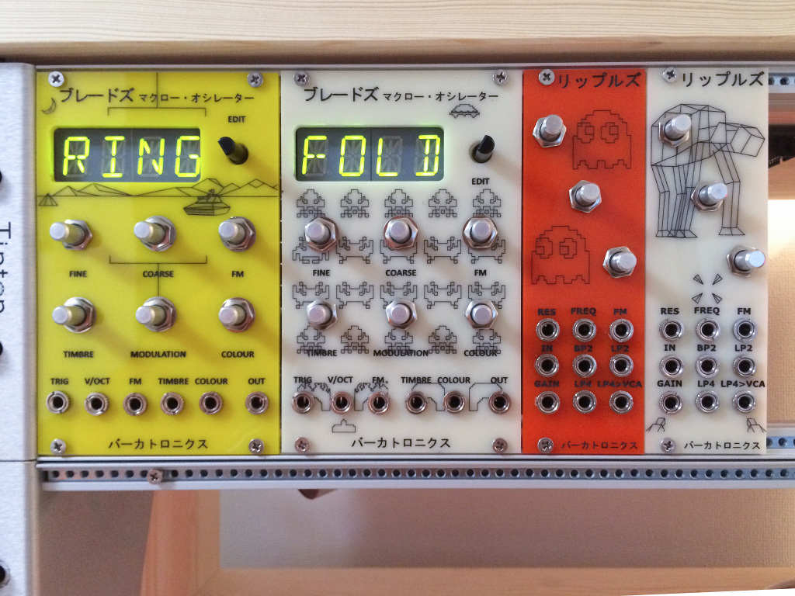
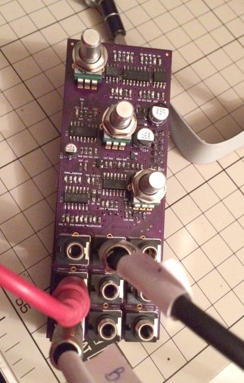

Ripples is another Mutable Instruments module built thanks to Émilie's open sourced designs. It's a 'classic' 4-pole multimode analog filter.

Thanks to Émilie's commitment to open sourcing her designs, all of the hardware and software for Ripples is available for use in personal projects.

## Goal

* Successfully DIY a second eurorack module

## Status

Complete

## References

- [Mutable Instruments Ripples](http://mutable-instruments.net/modules/ripples)
- [Mutable Instruments' Github page](https://github.com/pichenettes/eurorack/tree/master/ripples)
- [My Github notes for this project](https://github.com/barkertrax/eurorack/tree/master/ripples-diy)
- [Sharing my BOM at Modwiggler](https://www.modwiggler.com/forum/viewtopic.php?p=1914535#p1914535)

## Progress

### 2015-05-31 Front panels completed

A whole bunch of panels arrived in one load, so I was able to complete a number of projects in one fail swoop. Once again, I was so happy [I boasted about this on Modwiggler.](https://www.modwiggler.com/forum/viewtopic.php?p=1910041#p1910041)

I had this theme going on at that point around vintage vector graphics and as I was living in Japan I wanted that reflected too. The panels were all laid out in Inkscape and manufactured by an online company called Ponoko. Once the panels came back, I then filled the laser etched lines with paint and cleaned everything up once the paint dried. Really, really pleased with these.

### 2015-05-20 Populated a second PCB

I ordered 3 PCBs and built 2. The 3rd I passed on to my friend to share the love.

### 2015-05-19 PCB populated and working

[I told the world about this](https://www.modwiggler.com/forum/viewtopic.php?p=1914496#p1914496) on Modwiggler

### 2015-05-06 Ordered Components

Reconstructing the history from emails it seems I ordered all the parts from Mouser and had them delivered to Japan. Being a caring, sharing kind of guy, I [shared my BOM on Modwiggler.](https://www.modwiggler.com/forum/viewtopic.php?p=1914535#p1914535)

### 2015-04-29 Ordered PCBs

Bouyed up on the success of [building Braids](/projects/mutable-intruments-braids/) I next set my sights on MI Ripples.

I can see from my email history that they came from OSHPark at a cost of $32, shipped to Japan where I was living at that point. Half the cost of Braids.