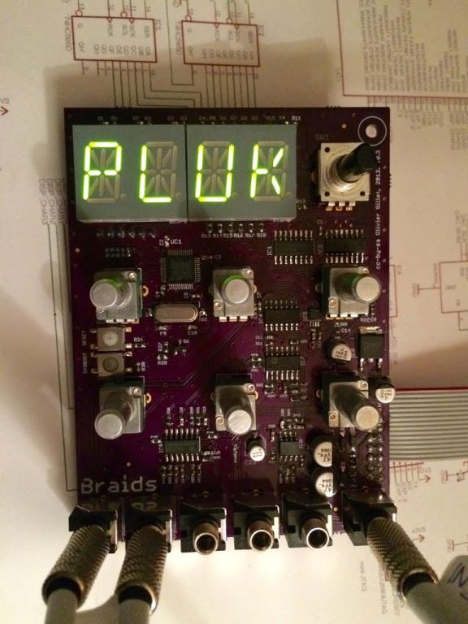

Braids is a "macro oscillator" designed by Émilie Gillet of Mutable Instruments. In contrast to the analog VCOs so often usually used in modular systems, Braids is an entirely digital system under voltage control - an STM32 is used here - which in the early 2010s was a little unusual.

Thanks to Émilie's commitment to open sourcing her designs, all of the hardware and software for Braids is available for use in personal projects.

## Goal

* Successfully DIY a eurorack module

## Status

Complete

## References

- [Mutable Instruments Braids](http://mutable-instruments.net/modules/braids)
- [Mutable Instruments' Github page](https://github.com/pichenettes/eurorack/tree/master/braids)
- [My Github notes for this project](https://github.com/barkertrax/eurorack/tree/master/braids-diy)
- [Modwiggler MI DIY Builds Thread](https://www.modwiggler.com/forum/viewtopic.php?t=120940)

## Progress

### 2015-05-31 Front panels completed

A whole bunch of panels arrived in one load, so I was able to complete a number of projects in one fail swoop. Once again, I was so happy [I boasted about this on Modwiggler.](https://www.modwiggler.com/forum/viewtopic.php?p=1910041#p1910041)

I had this theme going on at that point around vintage vector graphics and as I was living in Japan I wanted that reflected too. The panels were all laid out in Inkscape and manufactured by an online company called Ponoko. Once the panels came back, I then filled the laser etched lines with paint and cleaned everything up once the paint dried. Really, really pleased with these.

### 2015-05-20 Populated a second PCB

I ordered 3 PCBs and built 2. The 3rd I passed on to my friend to share the love.

### 2015-05-11 PCB populated and working

A big moment to have my first eurorack PCB fully complete and working. In fact, so big that [I boasted about](https://www.modwiggler.com/forum/viewtopic.php?p=1894999#p1894999) it on Modwiggler

### 2015-04-13 Ordered Components

Again, reconstructing the history from emails it seems I ordered all the parts from Mouser and had them delivered to Japan.

### 2015-03-30 Ordered PCBs

I don't remember much about the process of getting the boards ordered, in terms of whether I had to do anything to prepare the gerbers for manufacture. I think probably the assets on the MI GitHub were already good to go.

I can see from my email history that they came from OSHPark at a cost of $65, shipped to Japan where I was living at that point.